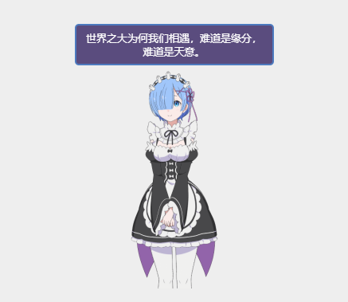

# hexo-live2d-rem

[](https://www.npmjs.com/package/hexo-live2d-rem)

## Preview



## Usage

Add this to `_config.yml`:
```yml
live2d_rem:
  enable: true
```

Then use the following command to initialize the plugin:
```bash
$ hexo live2d-rem -i
```

After that, when you run `hexo generate`, the page will add Rem automatically.

## Remove
Use the following command to remove:
```
$ hexo live2d -r
```

## License

[GPL-2.0](LICENSE)
